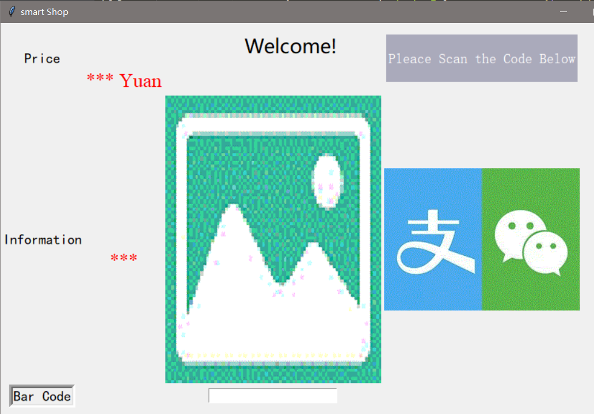
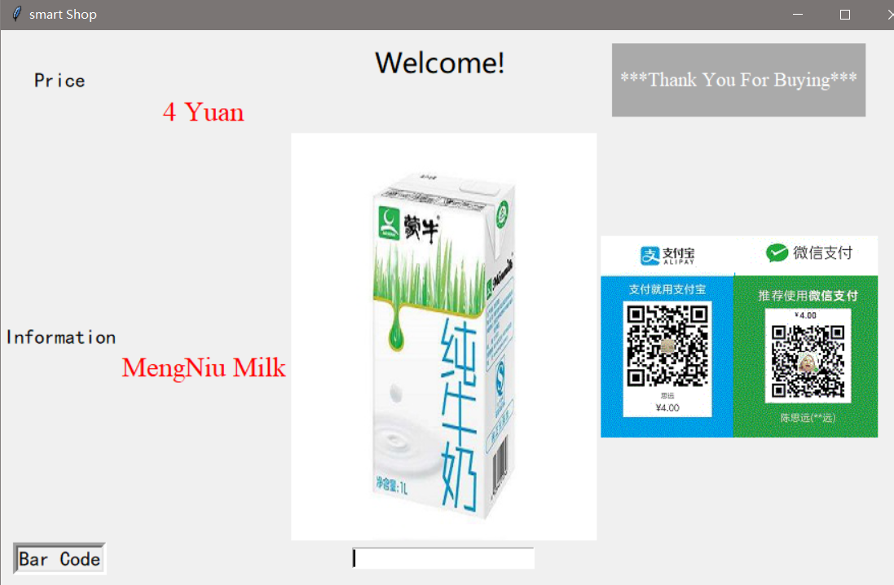

# Smart Shop

## Introduction
This is a Simple GUI Demo of the bottled water selling Program.
Demo_0.3 is a version of scaning barcode to record the item
Demo_0.4_audio adds the function that record one's voice therefore give back the item information

## Requirements
 ### For PC Users
 
 
 ### For Raspberry Pi installation

 Install Berryconda
 ```
 wget https://github.com/jjhelmus/berryconda/releases/download/v2.0.0/Berryconda3-2.0.0-Linux-armv7l.sh
 bash Berryconda3-2.0.0-Linux-armv7l.sh
 ```
 added by Berryconda3 installer
 ```
 export PATH="/home/blogbin/berryconda3/bin:$PATH"
 source ~/.bashrc
 conda update conda
 ```

## Demo_0.3 

 First the Program will give the default imformation for setup
<div align="center">
    
</div>

 After Entering the 13-bit bar code numbers, the system will look up the information in items.csv

  If there is such item, Commodity information will be displayed
  <div align="center">
      
      
  </div>

  Or，there isn't such an item, the following information will also be displayed, showing that there isn't such an item
  
  <div align="center">
       
  </div>
  
## Demo_0.4_audio
